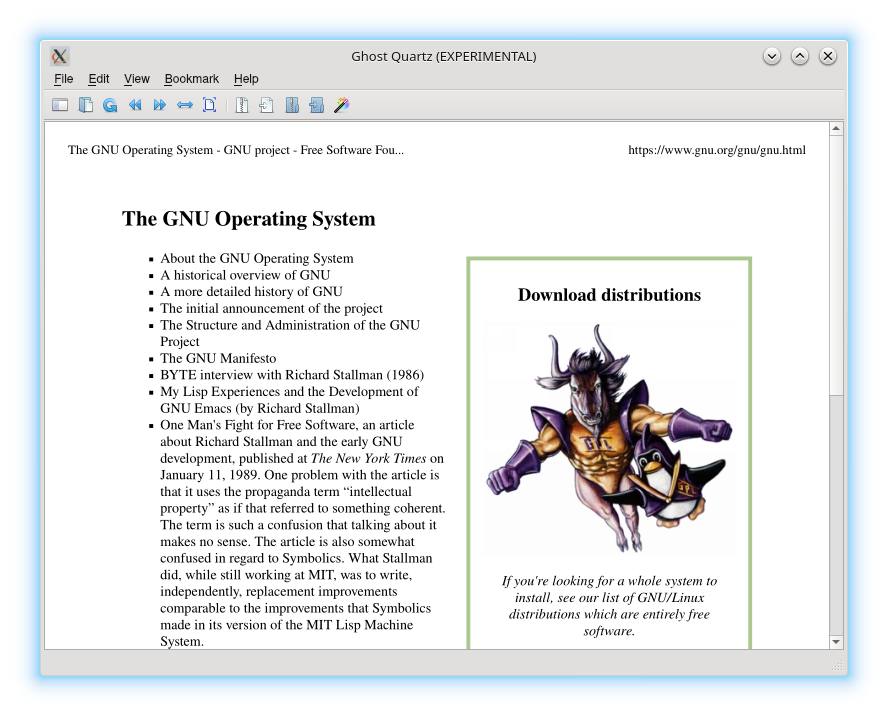
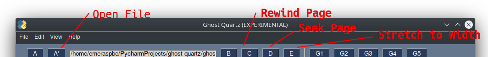

# Ghost Quartz

## Table of Contents
- [Introduction](#Introduction)
- [Installation](#Installaton)
- [Usage](#Usage)
- [License](#License)
## Introduction
Ghost Quartz is an experimental pdf viewer program aiming to have the
powerful feature of directly reading compressed pdf files. With no need
to extract a compressed pdf, disk space usage is optimized and saved.

Ghost Quartz is ideal for computers where secondary memory is costly.
The following archive formats are currently supported:
`.zip, .tar.gz, .tar.bz2, .tarxz`
## Installation
Ghost Quartz requires Python 3.6. A virtual environment is recommended.

To create a clone of the Ghost Quartz repository, simply do the  
following (HTTPS):
`git clone https://github.com/emeraldraspberry/ghost-quartz.git`

Ghost Quartz depends on packages used in the requirements.txt file:
`pip3 install -r requirements.txt`

Ghost Quartz will run when all requirements are satisfied:
`python3 ghost-quartz/app.py`

## Usage

User interface buttons are not final and will change, which may or may
not include: name changes, functionality changes, additions, or  
removals.
## License

Ghost Quartz is distributed under the GNU GPL v3 license.